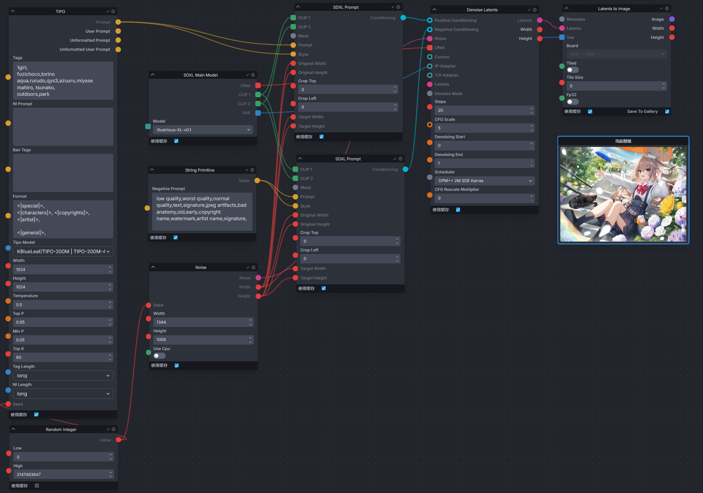

<div align="center">

# Invoke TIPO

_✨从输入的提示词生成详细的提示词_

📓 · [Documents](./README.md) · [中文文档](./README-zh.md)
</div>


## 简介
一个为 [InvokeAI](https://github.com/invoke-ai/InvokeAI) 添加 TIPO 节点的扩展，可将输入的简单的提示词扩展为详细的提示词，提高图片生成的质量。该节点移植自 [z-tipo-extension](https://github.com/KohakuBlueleaf/z-tipo-extension)。


## 安装
进入 InvokeAI 的节点目录（`invokeai/nodes`），若不清楚该路径在哪，可通过启动 InvokeAI 时终端显示的信息找到。

例如，InvokeAI 在启动时将显示 InvokeAI 的根目录。

```
[2024-10-03 22:01:25,401]::[InvokeAI]::INFO --> Root directory = E:\Softwares\InvokeAI\invokeai
```

从终端中可以知道 InvokeAI 的根目录在`E:\Softwares\InvokeAI\invokeai`，安装节点前就需要进入该目录中（`E:\Softwares\InvokeAI\invokeai\nodes`）。

进入 InvokeAI 的节点目录后，打开终端，输入下面的命令进行安装。

```
git clone https://github.com/licyk/invoke_tipo
```

或者将该 Github 仓库下载下来，并解压到该目录中。

安装完成后需重启 InvokeAI。


## 使用
进入 InvokeAI 的工作流中，在添加节点处搜索`TIPO`节点并添加。

在`invoke_tipo/workflow`中有示例工作流，可导入并使用。

有关 TIPO 的参数请阅读：[KohakuBlueleaf/z-tipo-extension - Options](https://github.com/KohakuBlueleaf/z-tipo-extension?tab=readme-ov-file#options)。

在运行工作流时，可从终端查看经过 TIPO 生成的提示词，例如。

```
[TIPO-KGen]-|21:44:15|-INFO: Upscaling Prompt
[TIPO-KGen]-|21:44:16|-INFO: Llama-cpp-python/gguf model TIPO-500M_TIPO-500M_epoch5-F16.gguf loaded
[TIPO-KGen]-|21:44:20|-INFO: Upscale Done
[TIPO-KGen]-|21:44:20|-INFO: TIPO Output Prompt:
====================================================================================================
- Prompt:
1girl,
azusa \(blue archive\),
fuzichoco, torino aqua, rurudo, qys3, azuuru, miyase mahiro, tsunako,

solo, outdoors, collarbone, halo, hair flower, crossed bangs, blurry, looking at viewer, flower, dress, park bench, bench, petticoat, pink flower, light particles, sidelocks, long sleeves, closed mouth, sitting, pink rose, hair between eyes, smile, frilled dress, day, feathered wings, long hair, white hair, very long hair, angel wings, black dress, tree, white wings, hair ornament, depth of field, school uniform, blush, blurry background, alternate costume, purple eyes, rose, wings, frills,

A young girl with long white hair and blue eyes. she is wearing a black and white dress with a pink flower crown on her head. the dress has a ruffled skirt and a bow at the waist. she has large white wings that are spread out behind her. the background is filled with colorful flowers and leaves, creating a magical and whimsical atmosphere. the girl is sitting on a bench in a park or garden, with trees and bushes in the background. the overall mood of the image is peaceful and serene.
====================================================================================================
- User Prompt:
1girl,
azusa \(blue archive\),
fuzichoco, torino aqua, rurudo, qys3, azuuru, miyase mahiro, tsunako,

solo, outdoors, park,

.
====================================================================================================
- Unformatted Prompt:
1girl,solo,
azusa \(blue archive\),
fuzichoco,torino aqua,rurudo,qys3,azuuru,miyase mahiro, tsunako,
outdoors,park

, collarbone, halo, hair flower, crossed bangs, blurry, looking at viewer, flower, dress, park bench, bench, petticoat, pink flower, light particles, sidelocks, long sleeves, closed mouth, sitting, pink rose, hair between eyes, smile, frilled dress, day, feathered wings, long hair, white hair, very long hair, angel wings, black dress, tree, white wings, hair ornament, depth of field, school uniform, blush, blurry background, alternate costume, purple eyes, rose, wings, frills

====================================================================================================
- Unformatted User Prompt:
1girl,solo,
azusa \(blue archive\),
fuzichoco,torino aqua,rurudo,qys3,azuuru,miyase mahiro, tsunako,
outdoors,park


====================================================================================================
```


## 鸣谢
- [@KohakuBlueleaf](https://github.com/KohakuBlueleaf) - 提供 TIPO。
