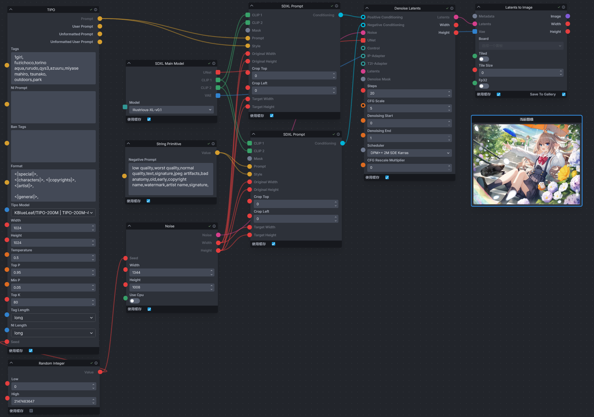

<div align="center">

# Invoke TIPO

_✨Generate detailed prompt from input tags_

📓 · [Documents](./README.md) · [中文文档](./README-zh.md)
</div>


## Info  
An extension that adds a TIPO node for [InvokeAI](https://github.com/invoke-ai/InvokeAI), which can expand simple input prompts into detailed prompts to improve the quality of image generation. This node is ported from [z-tipo-extension](https://github.com/KohakuBlueleaf/z-tipo-extension).


## Install
Navigate to the InvokeAI nodes directory (`invokeai/nodes`). If you are unsure of the path, you can find it by looking at the information displayed in the terminal when starting InvokeAI.

For example, when InvokeAI starts, it will display the root directory of InvokeAI.

```
[2024-10-03 22:01:25,401]::[InvokeAI]::INFO --> Root directory = E:\Softwares\InvokeAI\invokeai
```

From the terminal, you can see that the root directory of InvokeAI is at `E:\Softwares\InvokeAI\invokeai`, and you need to enter this directory (`E:\Softwares\InvokeAI\invokeai\nodes`) before installing the node.

Once you are in the InvokeAI nodes directory, open the terminal and enter the following command to install.

```
git clone https://github.com/licyk/invoke_tipo
```

Alternatively, download the GitHub repository and unzip it into the directory.

Restart InvokeAI after the installation is complete.


## Use
Within the InvokeAI workflow, search for the `TIPO` node and add it when you are at the point of adding nodes.

There are example workflows available in `invoke_tipo/workflow` that you can import and use.

Please read the parameters related to TIPO: [KohakuBlueleaf/z-tipo-extension - Options](https://github.com/KohakuBlueleaf/z-tipo-extension?tab=readme-ov-file#options).

When running a workflow, you can view the prompt words generated by TIPO, for example.

```
[TIPO-KGen]-|21:44:15|-INFO: Upscaling Prompt
[TIPO-KGen]-|21:44:16|-INFO: Llama-cpp-python/gguf model TIPO-500M_TIPO-500M_epoch5-F16.gguf loaded
[TIPO-KGen]-|21:44:20|-INFO: Upscale Done
[TIPO-KGen]-|21:44:20|-INFO: TIPO Output Prompt:
====================================================================================================
- Prompt:
1girl,
azusa \(blue archive\),
fuzichoco, torino aqua, rurudo, qys3, azuuru, miyase mahiro, tsunako,

solo, outdoors, collarbone, halo, hair flower, crossed bangs, blurry, looking at viewer, flower, dress, park bench, bench, petticoat, pink flower, light particles, sidelocks, long sleeves, closed mouth, sitting, pink rose, hair between eyes, smile, frilled dress, day, feathered wings, long hair, white hair, very long hair, angel wings, black dress, tree, white wings, hair ornament, depth of field, school uniform, blush, blurry background, alternate costume, purple eyes, rose, wings, frills,

A young girl with long white hair and blue eyes. she is wearing a black and white dress with a pink flower crown on her head. the dress has a ruffled skirt and a bow at the waist. she has large white wings that are spread out behind her. the background is filled with colorful flowers and leaves, creating a magical and whimsical atmosphere. the girl is sitting on a bench in a park or garden, with trees and bushes in the background. the overall mood of the image is peaceful and serene.
====================================================================================================
- User Prompt:
1girl,
azusa \(blue archive\),
fuzichoco, torino aqua, rurudo, qys3, azuuru, miyase mahiro, tsunako,

solo, outdoors, park,

.
====================================================================================================
- Unformatted Prompt:
1girl,solo,
azusa \(blue archive\),
fuzichoco,torino aqua,rurudo,qys3,azuuru,miyase mahiro, tsunako,
outdoors,park

, collarbone, halo, hair flower, crossed bangs, blurry, looking at viewer, flower, dress, park bench, bench, petticoat, pink flower, light particles, sidelocks, long sleeves, closed mouth, sitting, pink rose, hair between eyes, smile, frilled dress, day, feathered wings, long hair, white hair, very long hair, angel wings, black dress, tree, white wings, hair ornament, depth of field, school uniform, blush, blurry background, alternate costume, purple eyes, rose, wings, frills

====================================================================================================
- Unformatted User Prompt:
1girl,solo,
azusa \(blue archive\),
fuzichoco,torino aqua,rurudo,qys3,azuuru,miyase mahiro, tsunako,
outdoors,park


====================================================================================================
```


## Acknowledgement
- [@KohakuBlueleaf](https://github.com/KohakuBlueleaf) - Provide TIPO.
